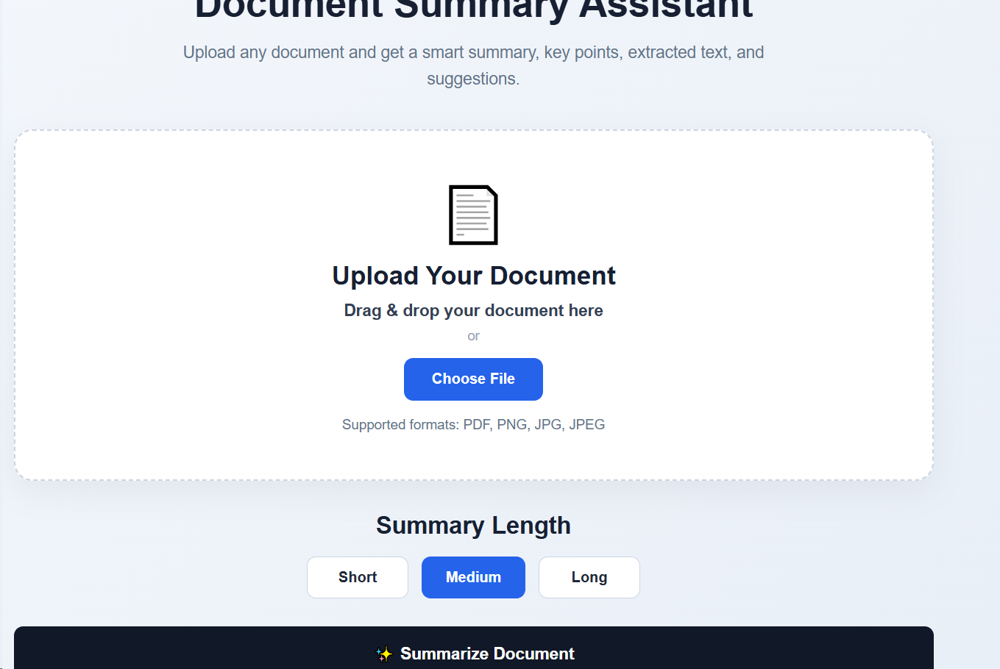
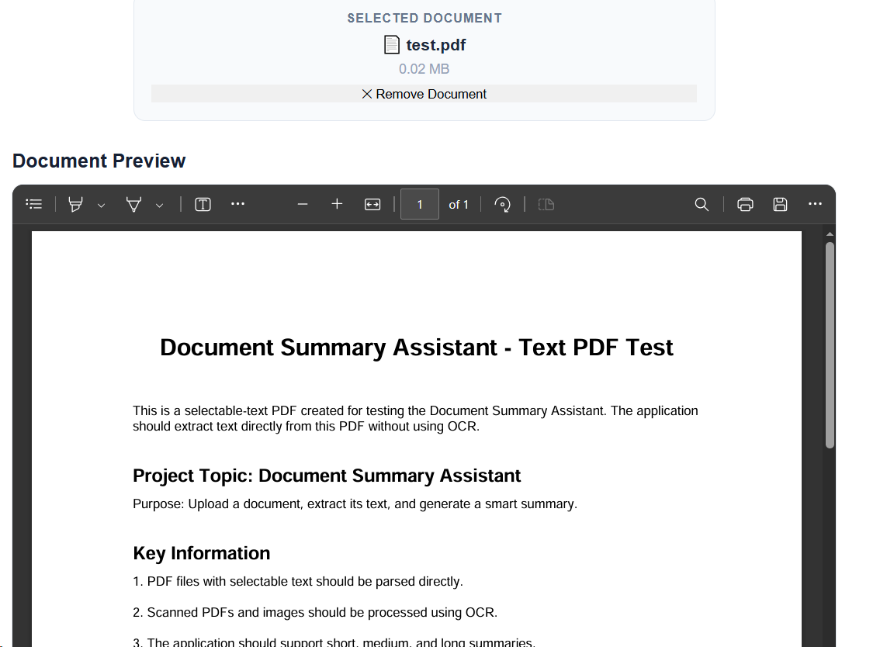
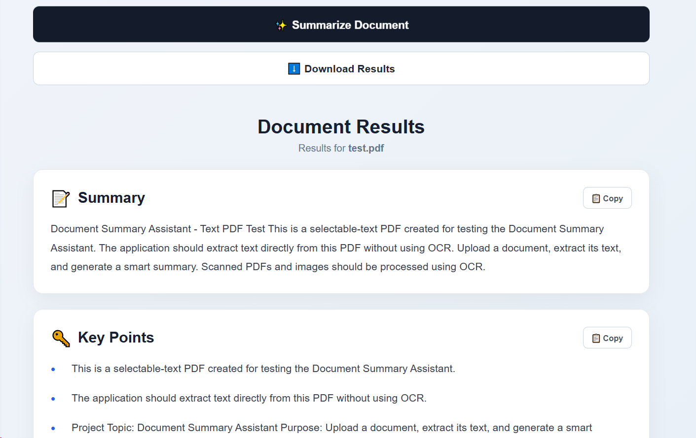

# Document Summary Assistant

A full-stack web application that allows users to upload PDF or image documents and automatically generate intelligent summaries.

The application extracts text from selectable-text PDFs and uses OCR for scanned PDFs and image documents. It then generates summaries, key points, extracted text, and improvement suggestions through a simple and responsive React-based interface.

---

## Features

* Upload PDF documents
* Upload PNG, JPG, and JPEG images
* Drag-and-drop document upload
* PDF and image preview
* Direct text extraction from selectable PDFs
* OCR processing for scanned PDFs and images
* Short, medium, and long summaries
* Key point extraction
* Extracted text display
* Improvement suggestions
* Copy summaries, key points, extracted text, and suggestions
* Download generated results as a text file
* Remove and replace uploaded documents
* Responsive user interface
* Django REST API backend

---

## System Architecture

```text
                         USER
                           |
                           v
                   React Frontend
                           |
                           v
                  Django REST API
                           |
                           v
                  Document Processing
                           |
                 +---------+---------+
                 |                   |
                 v                   v
          PDF Text Extraction      OCR
                 |              (Images /
                 |           Scanned PDFs)
                 +---------+---------+
                           |
                           v
                    Extracted Text
                           |
                           v
                  Summary Generation
                           |
              +------------+------------+
              |            |            |
              v            v            v
           Summary     Key Points   Suggestions
              |            |            |
              +------------+------------+
                           |
                           v
                    React Frontend
                           |
                 +---------+---------+
                 |                   |
                 v                   v
              Display          Copy / Download
```

---

## Project Structure

```text
document-summary-assistant/
│
├── backend/
│   ├── config/
│   │   ├── __init__.py
│   │   ├── asgi.py
│   │   ├── settings.py
│   │   ├── urls.py
│   │   └── wsgi.py
│   │
│   ├── documents/
│   │   ├── migrations/
│   │   ├── chunker.py
│   │   ├── extraction.py
│   │   ├── key_points.py
│   │   ├── ocr.py
│   │   ├── summarizer.py
│   │   ├── suggestions.py
│   │   ├── views.py
│   │   └── urls.py
│   │
│   ├── manage.py
│   └── requirements.txt
│
├── frontend/
│   ├── public/
│   ├── src/
│   │   ├── assets/
│   │   ├── components/
│   │   │   ├── ExtractedText.jsx
│   │   │   ├── KeyPoints.jsx
│   │   │   ├── Suggestions.jsx
│   │   │   ├── SummaryResult.jsx
│   │   │   └── UploadBox.jsx
│   │   ├── App.jsx
│   │   ├── App.css
│   │   ├── index.css
│   │   └── main.jsx
│   │
│   ├── index.html
│   ├── package.json
│   ├── package-lock.json
│   └── vite.config.js
│
├── .gitignore
└── README.md
```

---

## Technology Stack

### Frontend

* React
* Vite
* JavaScript
* HTML
* CSS

### Backend

* Python
* Django
* Django REST Framework

### Document Processing

* PDF text extraction
* OCR using Tesseract
* Image processing
* Text chunking

### Natural Language Processing

* Transformer-based summarization
* Key point extraction
* Text analysis
* Suggestion generation

---

## Application Workflow

1. User uploads a PDF or image.
2. The frontend sends the document to the Django REST API.
3. The backend determines the appropriate extraction method.
4. Text is extracted directly from selectable PDFs.
5. OCR is applied to scanned PDFs and image documents.
6. Extracted text is processed and chunked when required.
7. The summarization model generates the requested summary length.
8. Key points are extracted from the document.
9. Improvement suggestions are generated.
10. Results are returned to the React frontend.
11. The frontend displays the generated results.
12. Users can copy or download the results.

---

## Supported Documents

### PDF

* Selectable-text PDFs
* Scanned PDFs

### Images

* PNG
* JPG
* JPEG

---

## Backend Setup

Navigate to the backend directory:

```bash
cd backend
```

Create and activate a virtual environment:

### Windows

```powershell
python -m venv .venv
.venv\Scripts\activate
```

Install the required Python packages:

```powershell
pip install -r requirements.txt
```

Run the Django development server:

```powershell
python manage.py runserver
```

The backend will run at:

```text
http://127.0.0.1:8000/
```

---

## Frontend Setup

Open another terminal and navigate to the frontend:

```bash
cd frontend
```

Install the dependencies:

```bash
npm install
```

Start the development server:

```bash
npm run dev
```

Vite will provide the local frontend URL in the terminal.

---

## API

The application exposes a Django REST API for document processing and summarization.

### Summarization Endpoint

```text
POST /api/summarize/
```

The endpoint accepts an uploaded document and processes it through the document extraction, OCR, summarization, key point, and suggestion pipeline.

---

## Output

The application provides:

* Generated summary
* Selected summary length
* Extracted text
* Key points
* Improvement suggestions

Users can also copy the generated results or download them as a text file.

---

## Error Handling

The application handles common document-processing situations such as:

* Unsupported file formats
* Empty documents
* Documents with no extractable text
* OCR processing failures
* Invalid uploads
* Processing errors

---

## Project Status

**Completed**

The frontend, backend, document processing pipeline, OCR, summarization, key point extraction, suggestions, API integration, and end-to-end testing have been completed.

---

## Future Improvements

Possible future enhancements include:

* User authentication
* Document history
* Multiple language support
* Cloud deployment
* Advanced document analytics
* Database-based document storage
* Improved summarization models
* Export to PDF and DOCX
* Batch document processing

---

## Author

**Gopireddy Harsha Vardhan Reddy**

Document Summary Assistant — Full-Stack AI Document Processing Application
\

